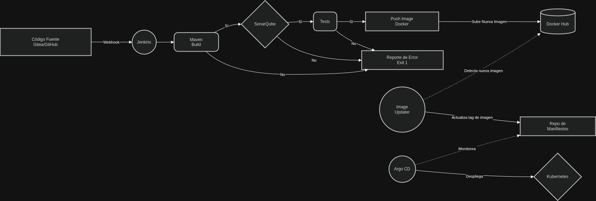

# Laboratorio CICD en Kubernetes

Enlace a documentación técnica y videos de implementación: [Ver documentación](https://docs.google.com/document/d/1yJ4LdiS1qGnR3nx7Cmjo5w60Jy6apKdcBsdNGmTIYQ8/edit?usp=sharing)

- Implementación CI/CD
  - Herramientas: Jenkins, Sonarqube, Helm, ArgoCD.
  - Descripción: Pipeline completo de CI/CD (Compilación, Test, SonarQube, DockerHub, Despliegue).

